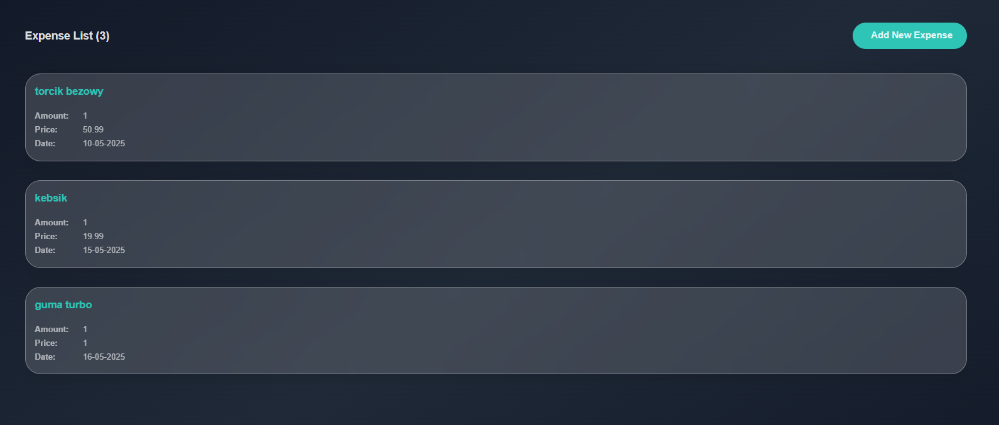

# 💰 **Capynance**

## 🚀 **Overview**

Capynance is an intuitive app designed to help you **track and manage expenses** . Built with a **Java Spring Boot** backend and **React** frontend, it aims to simplify personal finance management by providing clear insights into your spending habits.

Currently a **work in progress** , Capynance will offer features such as expense logging, categorization, and visual summaries to keep your finances organized and under control.

## 🎯 **Project Goals**

- Develop a seamless, user-friendly interface for expense tracking
- Enable categorization and filtering of expenses
- Provide meaningful visualizations of spending patterns
- Ensure responsive design for use across devices
- Add OCR

✨ Stay tuned as we build out more features to help you take control of your finances! ✨

#### DEMO - work in progress

